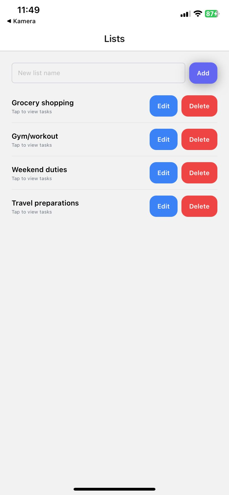
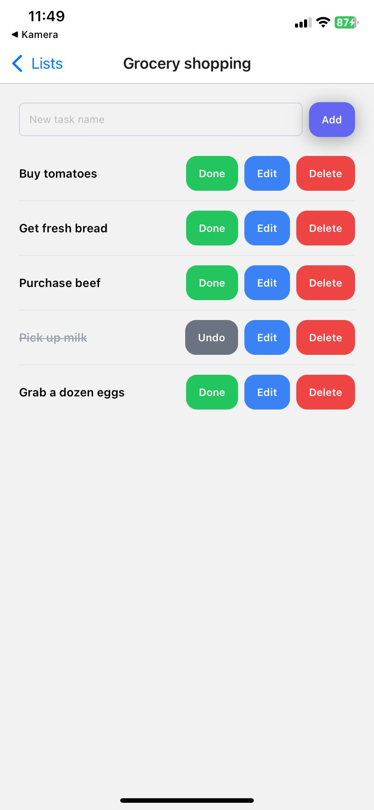

# 📱 TaskMaster - React Native Case Study

A comprehensive task and list management application built with React Native, demonstrating senior-level development practices and modern mobile app architecture.

## 🎯 Project Overview

This project showcases a production-ready task management application built for the SevenApps React Native case study. It demonstrates advanced React Native development practices, including async operations, state management, and modern UI/UX design.

## ✨ Key Features

### 📋 **List Management**
- Create, edit, and delete lists
- Real-time updates with optimistic UI
- Pull-to-refresh functionality
- Input validation with Zod

### ✅ **Task Management**
- Create, edit, toggle, and delete tasks
- Visual completion status with color-coded buttons
- Optimistic updates for smooth UX
- Due date display (when available)

### 🔄 **Advanced Async Operations**
- Loading states during network requests
- Error handling with user-friendly messages
- Retry mechanisms for failed operations
- Optimistic updates for immediate feedback

### 🎨 **Modern UI/UX**
- Clean, intuitive interface with NativeWind styling
- Responsive design for different screen sizes
- Loading indicators and error states
- Smooth animations and transitions

## 📱 Screenshots

### Lists Screen

*Main screen showing all lists with create, edit, and delete functionality*

### Tasks Screen

*Task management screen with completion toggle, edit, and delete options*

## 🏗️ Technical Architecture

### **Frontend Stack**
- **React Native** with Expo SDK 54
- **TypeScript** for type safety
- **NativeWind** (Tailwind CSS) for styling
- **Expo Router** for navigation

### **State Management**
- **TanStack Query** for server state management
- **Zustand** for client state management
- **React Query** for caching and synchronization

### **Data Layer**
- **SQLite** with Drizzle ORM
- **Zod** for runtime validation
- **Optimistic updates** for smooth UX

### **Development Tools**
- **ESLint** + **Prettier** for code quality
- **TypeScript** strict mode
- **Error boundaries** for graceful error handling

## 🚀 Getting Started

### Prerequisites
- Node.js 18+ 
- npm/yarn/pnpm
- Expo CLI
- iOS Simulator or Android Emulator (optional)

### Installation

```bash
# Clone the repository
git clone <repository-url>
cd sevenapps-react-native-case-study

# Install dependencies
npm install

# Generate database schema (REQUIRED)
npm run generate-schema

# Start development server
npm start
```

### Running the App

```bash
# Start Expo development server
npm start

# Run on iOS simulator
npm run ios

# Run on Android emulator
npm run android

# Run on web
npm run web
```

## 📁 Project Structure

```
├── app/                    # Expo Router pages
│   ├── _layout.tsx         # Root layout with providers
│   ├── index.tsx           # Lists screen
│   └── list/[id].tsx       # Tasks screen
├── components/             # Reusable UI components
│   ├── Button.tsx          # Custom button component
│   ├── Container.tsx      # Screen container
│   └── ErrorBoundary.tsx  # Error boundary component
├── queries/                # Data fetching hooks
│   ├── lists.hooks.ts      # List management hooks
│   └── tasks.hooks.ts      # Task management hooks
├── providers/              # Context providers
│   ├── database-provider.tsx
│   └── query-provider.tsx
├── validation/             # Input validation
│   └── schemas.ts          # Zod schemas
├── store/                  # Global state
│   └── store.ts            # Zustand store
└── assets/                 # Static assets
    └── screenShots/        # App screenshots
```

## 🔧 Key Implementation Details

### **Async Operation Handling**
- **React Query** for data fetching with automatic caching
- **Loading states** with skeleton screens
- **Error boundaries** with retry functionality
- **Optimistic updates** for immediate UI feedback

### **Data Validation**
- **Zod schemas** for runtime type checking
- **Input validation** for all user inputs
- **Error messages** with user-friendly feedback

### **State Management**
- **Server state**: TanStack Query for API data
- **Client state**: Zustand for UI preferences
- **Local state**: React hooks for component state

### **UI/UX Features**
- **Pull-to-refresh** on all screens
- **Loading indicators** during async operations
- **Error states** with retry options
- **Optimistic updates** for smooth interactions

## 🎨 Design System

### **Color Scheme**
- **Primary**: Indigo (#6366f1)
- **Success**: Green (#10b981)
- **Danger**: Red (#ef4444)
- **Warning**: Blue (#3b82f6)
- **Neutral**: Gray (#6b7280)

### **Typography**
- **Headings**: Font weight 700 (bold)
- **Body**: Font weight 400 (regular)
- **Buttons**: Font weight 600 (semibold)

### **Spacing & Layout**
- **Consistent padding**: 16px base unit
- **Border radius**: 12px for buttons, 16px for modals
- **Shadows**: Subtle elevation for depth

## 🧪 Testing Strategy

- **Unit tests** for utility functions
- **Component tests** for UI components
- **Integration tests** for user flows
- **Error boundary testing** for resilience

## 📊 Performance Optimizations

- **React Query caching** for reduced API calls
- **Optimistic updates** for perceived performance
- **Lazy loading** for large datasets
- **Memoization** for expensive calculations

## 🔒 Error Handling

- **Global error boundary** for unhandled errors
- **Network error handling** with retry mechanisms
- **Validation errors** with user feedback
- **Graceful degradation** for offline scenarios

## 🚀 Deployment

The app is built with Expo and can be deployed to:
- **iOS App Store** via EAS Build
- **Google Play Store** via EAS Build
- **Web** via Expo web build
- **Development builds** for testing

## 📈 Future Enhancements

- **Offline support** with data synchronization
- **Push notifications** for task reminders
- **Dark mode** theme support
- **Advanced filtering** and search
- **Task categories** and tags
- **Collaborative features** for team management

## 🤝 Contributing

This project demonstrates senior-level React Native development practices. Key areas of focus:

1. **Clean Architecture**: Separation of concerns with hooks, providers, and utilities
2. **Type Safety**: Full TypeScript coverage with strict mode
3. **Error Handling**: Comprehensive error boundaries and user feedback
4. **Performance**: Optimized re-renders and efficient data fetching
5. **User Experience**: Smooth interactions with optimistic updates

## 📄 License

This project is part of the SevenApps React Native case study and is intended for evaluation purposes.

---

**Built with ❤️ using React Native, TypeScript, and modern mobile development practices.**